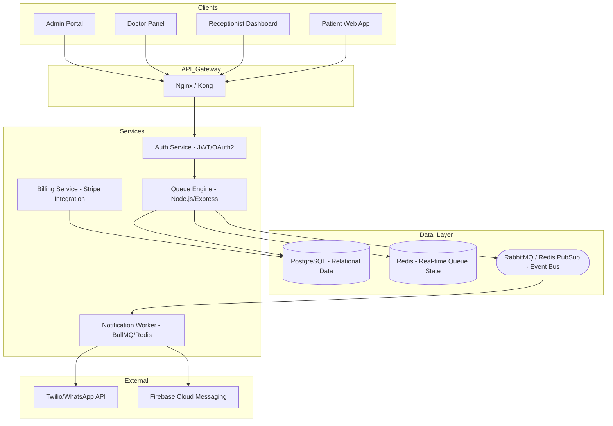

# System Architecture Design: Q-Ease (Real-Time Token Queue)

**Author:** Senior Software Architect  
**Paradigm:** Event-Driven Microservices  
**Tenancy:** Logical Separation (Shared Database, Tenant-ID Partitioning)

---

## 1. High-Level Architecture Diagram

---

## 2. Core Services Breakdown

### 2.1 Auth Service
- **Responsibility:** Multi-tenant authentication, RBAC (Role-Based Access Control).
- **Scope:** Defines `tenant_id` for all subsequent requests. Use Clerk or Supabase Auth for MVP, or a simple Passport.js implementation for open-source.

### 2.2 Queue Engine (The Heart)
- **Responsibility:** Token generation, state management (Active, Serving, No-show, Cancelled).
- **Optimization:** Keep the "Active Queue" in **Redis Sorted Sets** (`ZSET`).
    - *Score:* Token sequence number.
    - *Value:* Patient ID / Metadata.
- **Actions:** `JOIN_QUEUE`, `CALL_NEXT`, `PAUSE_QUEUE`, `PRIORITIZE`.

### 2.3 Notification Service
- **Responsibility:** Asynchronous delivery of reminders.
- **Trigger:** Event-driven (e.g., `QueueUpdated` event).
- **Logic:** Calculates thresholds (10, 5, 2, 1) and pushes to workers.

### 2.4 Billing & Subscription
- **Responsibility:** Handling SaaS tiers, trials, and coupons.
- **Integration:** Stripe Webhooks for subscription lifecycle.

---

## 3. Justification: Event-Driven vs. REST

| Approach | Use Case in Q-Ease | Justification |
|:---|:---|:---|
| **REST API** | Command Actions (Join, Call Next) | Simple, synchronous confirmation for the user that an action was received. |
| **WebSockets** | Real-time Updates | Essential for the "Live Queue" view so patients don't need to refresh. |
| **Event-Driven** | Side-Effects (Notifications, Logs) | Calling a patient should not wait for an SMS to be sent. Decoupling notification latency from the core logic is critical for scale. |

---

## 4. Tech Stack (Open-Source Focused)

- **Backend:** Node.js (TypeScript) with Express (Fast for MVP).
- **Database:** PostgreSQL (Robust relational integrity for multi-tenancy).
- **In-Memory Store:** Redis (For queue state and Pub/Sub).
- **Message Broker:** RabbitMQ or Redis Streams.
- **Real-time:** Socket.io or WebSockets.
- **Frontend:** Next.js (SSR for SEO on clinic landing pages).
- **Validation:** Zod (Type-safe schemas).

---

## 5. Scaling Strategy (to 1000+ Clinics)

1. **Database Partitioning:** Use `tenant_id` in every table. Create indexes on `tenant_id`. For 1000+ clinics, consider **Citus Data** (Postgres extension) for horizontal scaling.
2. **Redis Sharding:** As queue updates increase, shard Redis by `tenant_id` hash.
3. **Stateless Services:** All services should be stateless, allowing horizontal scaling behind a Load Balancer.
4. **Read Replicas:** Use read replicas for the Admin Dashboard and reporting to avoid locking the primary DB during heavy queries.

---

## 6. Cost-Efficient MVP Approach

- **Deployment:** DigitalOcean App Platform or AWS App Runner (PaaS simplicity, low starting cost).
- **Database:** Managed Postgres (starting at $15/mo).
- **Caching:** Managed Redis (starting at $15/mo).
- **Notifications:** Use WhatsApp/SMS only for "Your Turn" to save costs; use **Browser Push Notifications** or **WebSockets** for early thresholds (10, 5, 2, 1).
- **Monitoring:** Open-source **Prometheus/Grafana** for observability.

---

## 7. Extensibility for Future (Salons, Restaurants)

- **Template Engine:** Store service types in a JSONB column in Postgres. Clinic template vs. Restaurant template determines the metadata collected (e.g., "Party Size" for restaurants vs. "Service Type" for clinics).
- **Strategy Pattern:** Implement a `QueueStrategy` interface to handle different queuing logics (FIFO for clinics, Table-assignment for restaurants).
